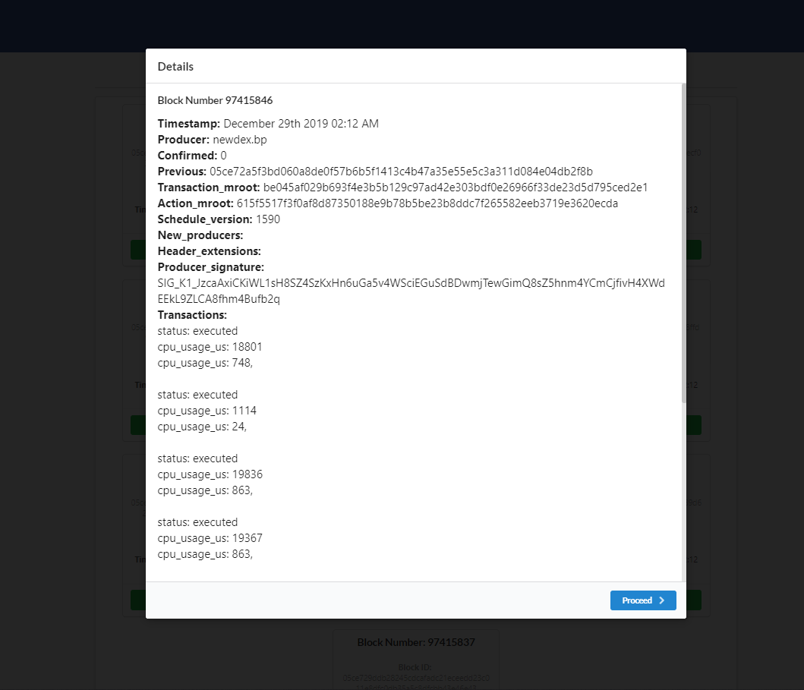

# EOSIO/EOS - Recent Blocks

## **Abstract:**

_Use EOSJS to show most recent blocks from EOSIO blockchain in detail._

## **Installation Instructions:**

Open Your Terminal

### Copy and paste the following lines below into your terminal:

```bash
git clone https://github.com/GregGains/eos-blocks
```

```bash
cd eos-blocks/
```

```bash
npm install
```

```bash
npm clientinstall
```

```bash
npm run dev
```

## **Project Background:**

This project integrates EOSIO blockchain information into a web based application.

## **Project Goals:**

- Provide current EOSIO blockchain information.
- Design a back-end with Node.js & Express.
- Design a front-end user interface in React.
- Write understandable and well commented code.
- Unit test extensively.

## **Main View:**


## **Block Details:**


